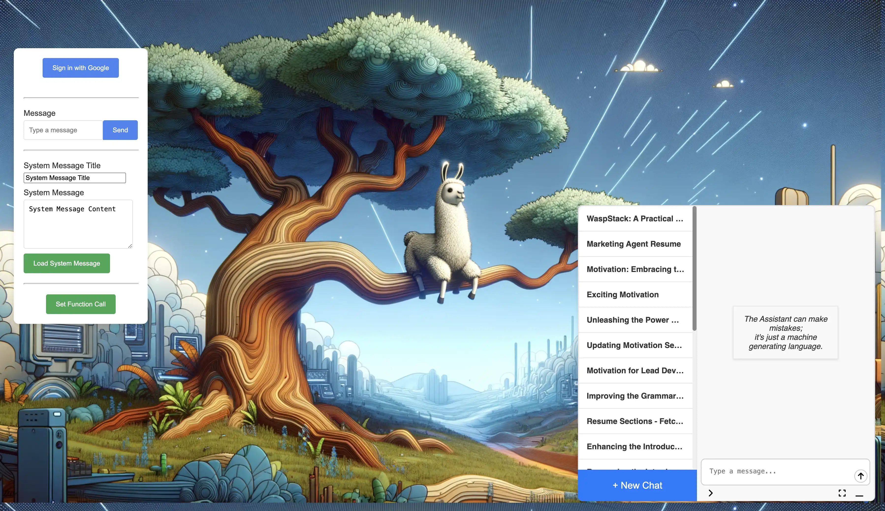

# Llama Tree API & Chat Widget



## LlamaTree: Simplifying AI Integration in Your Projects

**Effortless Integration, Focused Innovation**

**Introduction**

Welcome to LlamaTree, the internal library that streamlines the integration of AI chat assistants into your application. Designed to bypass the repetitive groundwork, LlamaTree lets your team jump directly into the creative and interactive aspects of AI development.

### Bypassing the Boredom with LlamaTree

LlamaTree is designed to eliminate the setup tasks in AI chat integration, allowing teams to focus on the exciting parts of AI Assistant development. Here’s a concise overview of its key features:

- **Streamlined Chat Functionality:** LlamaTree not only saves user and assistant messages and function calls but also allows for the regeneration of assistant messages and editing of user messages. It supports real-time message streaming and pre-loading of data messages for responsive assistant interactions.
- **Enhanced User Experience:** Automatically generates concise conversation titles for easy reference and maintains user-specific chat histories, all secured through robust authentication mechanisms.
- **Seamless Integration and Compatibility:** Flexible to work with any AI of your choice, LlamaTree streamlines function calls to the host application. It’s readily available as a React library on NPM and can be integrated into any HTML/JS environment, living in the DOM for easy front-end control.
- **Robust System Management:** With advanced error handling and the ability to control the chat flow, including stopping the stream and sending signals to the AI vendor, LlamaTree ensures a smooth and reliable operation.

LlamaTree offers a comprehensive solution that covers every aspect of AI chat integration, from user interaction to system management, ensuring that your focus remains on innovation and creativity.

**LlamaTree's Core Features**

- **Simplified Function Calls:** LlamaTree uniquely enables AI to interact with your existing project through JSON responses. These responses include the function name and its arguments, allowing for seamless integration and interaction.
- **Customizable AI Options:** Choose to implement your own AI model or your client's, with easy adaptability to different requirements.
- **Rich Chat Functionalities:** Besides managing function calls, LlamaTree comes equipped with a wide array of chatting features to enhance user interaction.

**The Technical Edge**

LlamaTree makes AI responses more than just text replies; it turns them into actionable insights directly linked to your application's functions. This direct link between AI output and application response paves the way for more dynamic and interactive AI experiences.

**Benefits**

- **Direct Focus on Innovation:** With the foundational setup taken care of, your team can immediately start working on the engaging parts of AI development.
- **Seamless Application Interaction:** LlamaTree’s ability to handle function calls ensures that AI can effectively interact with and enhance your existing project.
- **Time and Resource Efficiency:** Reduce the time spent on setup and allocate more resources towards innovation and user experience enhancement.

**Conclusion**

Adopt LlamaTree and transform the way you integrate AI into your projects. It’s not just about adding AI; it’s about making AI work in harmony with your application, effortlessly and effectively.

**Get Started with LlamaTree**

Incorporate LlamaTree in your project today and focus on what’s truly exciting about AI development. Experience the ease of AI integration that aligns perfectly with your project's needs.

### Feature List for LlamaTree

#### 1. Chat Functionality
- **Saves User and Assistant Messages and Function Calls:** Efficiently records all interactions and function calls for easy reference.
- **Regenerate Assistant Messages and Edit User Messages:** Offers flexibility in message management, allowing iteration between changes.
- **Streams Assistant Message:** Real-time streaming of assistant messages for dynamic interaction.
- **Load Data Messages in Chat for the Assistant:** Pre-loads data messages that are sent when the user interacts, enhancing the assistant's responsiveness.

#### 2. User Experience
- **Automated Three-Word Conversation Title in History:** Generates concise and meaningful titles for each conversation in the history log.
- **Lists History of Chats for Logged-In User:** Provides a user-specific chat history for easy tracking and reference.
- **Authentication:** Ensures secure access and user verification.

#### 3. Integration and Compatibility
- **Bring Your Own AI:** Offers the flexibility to integrate any AI of your choice or the client's preference.
- **Function Calls Stream to the Host:** Seamlessly sends function calls to the host application, facilitating dynamic interactions.
- **React Library Available on NPM:** Easily accessible for React developers, with support for integration into any HTML/JS environment.
- **Llama-Tree Lives in the DOM and Is Controllable Through the Front-End:** Offers front-end control for seamless integration into the web environment.

#### 4. System Management
- **Error Handling:** Robust error management for smoother operation and reliability.
- **Stopping the Stream and Sending a Stop Signal to the AI Vendor:** Provides control over the chat flow, including the ability to halt interactions as needed.

## Overview

### Introduction to Llama Tree

Llama Tree integrates an AI assistant, powered by OpenAI and iOgpt, into a chat widget that can be added to any website. This assistant was initially developed for translation tasks but has since expanded its capabilities to cover a broader range of functions. The assistant interacts with users and web applications via an API, facilitating information delivery and task execution.

### The Llama Tree Chat Widget

The Llama Tree chat widget is positioned in the bottom left corner of a webpage and is designed as a web component for integration into various frontend environments. It is compatible with different types of web applications and aims to provide a consistent user experience across these platforms. The chat widget serves as the interface for user interactions with the AI assistant, enabling a range of functions from simple queries to complex requests.

### Integration Process

Integrating the Llama Tree chat widget into a web application involves adding a script tag to the frontend. This process is designed to be straightforward, with the goal of making the widget easily accessible across different web environments. The widget is intended to augment the functionality of web applications by providing users direct access to the AI assistant's capabilities.

### Functionality and Applications

Llama Tree is suitable for a variety of web applications, including e-commerce sites, educational platforms, and service portals. The AI assistant within the chat widget can handle diverse tasks, from customer service inquiries to providing instant information. Its functionality is designed to enhance user interaction and efficiency on web platforms.

## Technical Stack

- Node.js
- Redux toolkit
- React (for the Chat Widget)
- TypeScript
- Docker
- Firebase Firestore (migration to a Dockerized Hasura planned)
- OpenAI & iOgpt
- Express.js

## File Structure

Key directories and files:

- `server/`: Contains server-side application logic.
- `widgets/chat/`: Front-end React application for the chat interface.
- `Dockerfile`, `docker-compose.yaml`: Docker configurations.
- `server/.env.example`: Template for required environment variables.

## Installation and Setup

1. Create a new Firestore instance and a web app in the Firebase console to obtain the client and admin API keys.
2. Populate the `.env` file with these keys and other necessary configurations as per `server/.env.example`.

> [!IMPORTANT]
> Always keep your environment variables secure, especially your Firebase API keys, to prevent unauthorized access.

3. Clone the repository and navigate to the project directory.
4. Build the Docker images: `docker-compose build`.
5. Start the Docker containers: `docker-compose up`.

## Using the Sandbox Environment

The Llama Tree project includes a sandbox environment, which provides a simple and interactive way to test and demonstrate the chat widget's capabilities.

### Sandbox Setup

#### Configure Firebase

1. Create a file named `firebaseConfig.js` in the `widgets/chat/sandbox/vanilla/` directory.
2. Copy the contents of `firebaseConfig.example.js` into this new file.
3. Replace the values in `firebaseConfig.js` with your own Firebase project's configuration.

#### Running the Sandbox

- Ensure the Llama Tree server is running and accessible.
- Open `index.html` in a web browser.
- The sandbox provides a UI for signing in with Google, sending messages, and loading system messages into the chat widget.

#### Features Demonstrated in Sandbox

- **Google Sign-In:** Authenticate users with their Google account.
- **Send Messages:** Interact with the chat widget by sending messages and receiving responses.
- **Load System Messages:** Test loading predefined system messages into the chat.
- **Function Calls:** Simulate function calls to test widget's response to various inputs.

The sandbox environment is an excellent tool for developers to experiment with the chat widget's functionalities in a controlled setting.

## Integrating the Chat Widget Web Component

The Llama Tree project provides a dynamic endpoint `/module`, which serves the necessary JavaScript for integrating the chat widget into various frontend environments.

### Integration Steps

1. **Include the Web Component Script:**
   Insert `<script src="localhost:3001/module"></script>` into the HTML header of your frontend application, where `localhost:3001` is the URL of the deployed server. This script dynamically creates and appends the `llama-tree-chat-widget` element to the document body and loads the necessary widget script.
2. **Initialization:**
   The script obtained from the `/module` endpoint automatically performs the necessary initialization for the chat widget. It creates a `llama-tree-chat-widget` element, sets the server URL, and loads the widget's JavaScript module.

### Widget Configuration

Upon loading the script from the `/module` endpoint, the chat widget is ready for use. The widget interacts with the server to handle chat functionalities and assistant interactions. Ensure that the server is properly configured and running to enable full functionality of the chat widget.

### Web Component API

These methods provide a comprehensive API for interacting with the chat widget, offering functionalities for managing messages, session parameters, UI state, and event handling.

#### 1. `chatWidget` Instance

The `ChatWidgetElement` class exposes several methods and properties for interacting with the chat widget

```javascript
const chatWidget = document.querySelector('llama-tree-chat-widget');
```

#### 2. `setProps(props: LlamaTreeProps)`

Configure the widget with custom properties and event handlers.

```javascript
chatWidget.setProps({
  user: firebaseUser, // Your authenticated Firebase user
  customCssUrl: 'https://yourserver.com/custom-style.css',
  onLlamaAction: (action) => console.log('Action occurred:', action),
  onFunctionCall: (functionCall) => console.log('Function called:', functionCall)
});
```

#### 3. `loadSystemMessage(systemMessage: LlamaLoadedSystemMessage)`

Load a system message into the chat.

```javascript
chatWidget.loadSystemMessage({
  title: 'System Alert',
  content: 'This is a system-generated message.'
});
```

#### 4. `removeLoadedSystemMessage(id: string)`

Removes a specific loaded system message from the chat by its ID.

```javascript
chatWidget.removeLoadedSystemMessage('messageId123');
```

#### 5. `loadSystemMessages(systemMessages: LlamaLoadedSystemMessage[])`

Loads multiple system messages into the chat.

```javascript
chatWidget.loadSystemMessages([
  { title: 'Welcome', content: 'Hello! How can I assist you?' },
  { title: 'Notice', content: 'System will be under maintenance tonight.' }
]);
```

#### 6. `removeLoadedSystemMessages(ids: string[])`

Removes multiple loaded system messages from the chat using their IDs.

```javascript
chatWidget.removeLoadedSystemMessages(['messageId123', 'messageId456']);
```

#### 7. `emptyLoadedSystemMessages()`

Clears all loaded system messages from the chat.

```javascript
chatWidget.emptyLoadedSystemMessages();
```

#### 8. `sendLlamaMessage(message: string, params?: LlamaChatParams)`

Send a message to the assistant.

```javascript
chatWidget.sendLlamaMessage('Hello there!', { model: 'gpt-3.5-turbo' })
  .then(response => console.log('Assistant response:', response));
```

#### 9. `setChatParams(params: LlamaChatParams)`

Set parameters for the chat session.

```javascript
chatWidget.setChatParams({
  model: 'gpt-4',
  max_tokens: 150
});
```

#### 10. `setChatView(view: Partial<LlamaChatViewSliceState>)`

Configures the chat view's appearance and behavior, such as opening or closing the chat window, showing the history drawer, etc.

```javascript
chatWidget.setChatView({
  isOpen: true,
  isLarge: false,
  isHistoryDrawerOpen: true
});
```

#### 11. `setChatId(chatId: string)`

Sets the current chat session ID, typically used for managing and retrieving specific chat sessions.

```javascript
chatWidget.setChatId('uniqueChatSessionId');
```

#### 12. `onFunctionCall(callback: (functionCall: FunctionCall) => void)`

Sets a callback function to be invoked when a function call is made within the chat.

```javascript
chatWidget.onFunctionCall((functionCall) => {
  console.log('Received function call:', functionCall);
});
```

#### 13. `onLlamaAction(callback: (action: LlamaActions) => void)`

Sets a callback function to be invoked when an action occurs in the chat, allowing for custom event handling.

```javascript
chatWidget.onLlamaAction((action) => {
  console.log('Received action:', action);
});
```

## Tutorial: Function Calling for Page Redirection

### Step 1: Define an Array of Page Names

First, create an array of page names that represents the different pages users can be redirected to.

```javascript
const pages = {
  home: '/',
  about: '/about',
  contact: '/contact'
  // Add more pages as needed
};
```

### Step 2: Set Chat Parameters with `redirectTo` Function

Configure the chat widget to recognize a `redirectTo` function call. This function will be used to redirect users to different pages.

```javascript
chatWidget.setChatParams({
  functions: [
    {
      name: 'redirectTo',
      parameters: {
        type: 'object',
        properties: {
          page: {
            type: 'string',
            enum: Object.keys(pages)
          }
        },
        required: ['page']
      },
      description: 'Redirects to a specified page'
    }
  ]
});
```

In this setup, the `redirectTo` function expects a parameter `page` which should be one of the keys in the `pages` object.

### Step 3: Handle Function Calls for Redirection

Implement a handler for the `redirectTo` function call within the `onFunctionCall` method. This function will change the window's location based on the page specified in the function call.

```javascript
chatWidget.onFunctionCall((functionCall) => {
  if (functionCall.name === 'redirectTo') {
    const pageName = functionCall.arguments.page;
    const pageUrl = pages[pageName];

    if (pageUrl) {
      window.location.href = pageUrl; // Redirects the user to the new URL
    } else {
      console.error('Page not found:', pageName);
    }
  }
});
```

This function checks if the `redirectTo` function call is made and then redirects the user to the URL associated with the specified page name. If the page name doesn't exist in the `pages` object, it logs an error.

By following these steps, you'll be able to use function calls within your chat widget to redirect users to different pages of your web application. This tutorial assumes that you have a basic understanding of how the chat widget integrates into your application and that the widget is already set up to handle function calls.

### Simulated Chat Conversation

```plaintext
Message 1: User
"Hello! Can you help me navigate your site?"

Message 2: Assistant
"Of course! I can guide you through our website. Which section would you like to visit?"

Message 3: User
"I'm looking for contact information."

Message 4: Assistant
"You can find our contact information on the Contact page. Would you like me to take you there?"

Message 5: User
"Yes, please take me to the Contact page."

Assistant (Function Call Triggered)
```

At this point, the assistant triggers the `redirectTo` function call with the argument to redirect to the Contact page.

## Configuring Firebase Security Rules

Proper configuration of Firebase security rules is essential for ensuring the security and integrity of your chat data. These rules control who has read and write access to your Firebase database. For the Llama Tree Chat Widget, specific rules need to be set to ensure that chat data can only be accessed and modified by authorized users.

### Setting Up Security Rules

To set up these rules, navigate to the Firebase Console, select your project, go to the Firestore Database section, and then to the 'Rules' tab. Update your security rules as follows:

```plaintext
rules_version = '2';
service cloud.firestore {
  match /databases/{database}/documents {
    // Rules for assistant chat
    match /assistantChat/{userId} {
      // Allows creating chat sessions for authenticated users
      allow create: if request.auth.uid != null;

      // Sub-collection 'chats' can only be read and written by the user who owns this assistantChat document
      match /chats/{document=**} {
        allow read, write: if request.auth.uid == userId;
      }
    }

    // Add other rules as necessary for your application
  }
}
```

### Explanation of Rules

- The rule under `/assistantChat/{userId}` allows authenticated users to create a chat session.
- The nested rule within `/assistantChat/{userId}/chats/{document=**}` ensures that the chats sub-collection can only be accessed by the user who owns the parent `assistantChat` document.

### Important Notes

- Always validate and test your security rules in the Firebase Console to ensure they work as expected.
- Regularly review and update your rules to maintain security, especially if you make changes to how your application interacts with Firestore.

Including these security rules ensures that your application's chat data is secure and is accessed appropriately in line with your application's logic and user authentication.

> [!WARNING]
> Modifying Firebase security rules incorrectly can lead to vulnerabilities. Always review and test rules thoroughly.

## Current Limitations

- **Fallback Mechanisms**: There are no fallback systems in place yet. This is a proof-of-concept, and while errors are handled and displayed in the widget, the error messaging could be made more user-friendly.
- **Scaling and Performance**: The project has not been fully tested for scaling and performance, particularly with Firestore and SSE. There are known race conditions that need addressing.

> [!CAUTION]
> Integrating the chat widget on websites with heavy traffic requires additional considerations for scaling and performance.

## Future Plans

- **Database Migration**: We plan to migrate from Firestore to a dockerized Hasura for better database management.
- **Admin Panel**: Development of an admin panel for more straightforward management of function calls and future features to fine-tune the assistant.

## Contributing

Contributions are welcome. Please follow the guidelines in `CONTRIBUTING.md` (if available).

## License

This project is licensed under the MIT license. See the `LICENSE` file for details.
